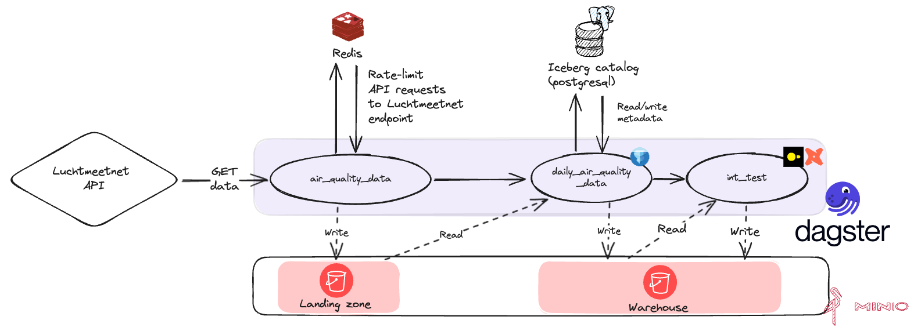

# dagster-pyiceberg example using an Postgresql catalog

> [!WARNING] dagster-pyiceberg is in development
>
> The `dagster-pyiceberg` library is in development.

This repository contains an example for [dagster-pyiceberg](https://jasperhg90.github.io/dagster-pyiceberg/) with a postgresql backend.

## The DAG

The example DAG is hosted [here](). It ingests measured air quality data for 99 stations in The Netherlands from the [Luchtmeetnet API](https://api-docs.luchtmeetnet.nl/). Read the [repository README]() for more information.

> [!info] Missing partitions
>
> Dagster will mark the `air_quality_data` asset as 'failed' because some stations return 500 errors. This is expected.

## Setup

This repository contains a devcontainer that spins up all required resources using docker-compose. It sets up:

- A Redis database container to serve as a [backend](https://pyratelimiter.readthedocs.io/en/latest/modules/pyrate_limiter.buckets.redis_bucket.html) for pyrate-limiter.
- A postgresql container to serve as the [PyIceberg catalog](https://py.iceberg.apache.org/reference/pyiceberg/catalog/sql/) backend.
- [MinIO](https://min.io/) for S3-compatible storage to serve as landing zone & data warehouse.

All required details required to connect to the above services are added to the dotenv file found in .devcontainer/.env. This dotenv file is automatically loaded in the devcontainer environment.

### Installing dependencies

Execute `just s` to install the python dependencies.

### Creating a landing zone bucket

The 'warehouse' bucket is automatically created on startup, but the 'landingzone' bucket needs to be created manually. To do this, execute `just clz`.

### Creating an iceberg namespace

You can create the 'air_quality' namespace by executing `just cn`.

## Running the example

You can run the example by executing `just dd`. The Dagster UI will be available on [localhost:3000](http://localhost:3000)

Minio is available on [localhost:9001](http://localhost:9001). Username and password are 'pyiceberg'.

## Inspecting the generated tables using `pyiceberg`

You can find Jupyter notebooks in the 'notebooks' folder.
