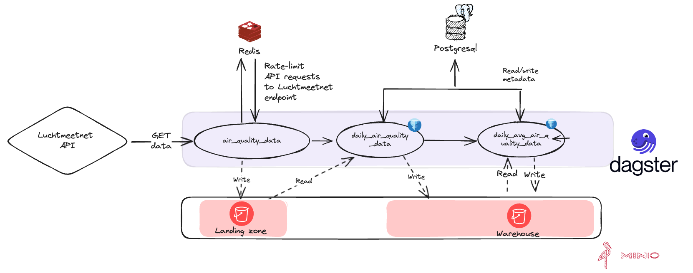

# dagster-pyiceberg example using postgresql catalog

> [!WARNING] dagster-pyiceberg is in development
>
> The `dagster-pyiceberg` library is in development. It depends on unreleased changes in the `pyiceberg` library.

This repository contains an example for [dagster-pyiceberg](https://jasperhg90.github.io/dagster-pyiceberg/) with a postgresql backend.

## The example

This example ingests measured air quality data for 99 stations in The Netherlands from the [Luchtmeetnet API](https://api-docs.luchtmeetnet.nl/).

This example contains two assets:

- **air_quality_data**: Ingests data from the Luchtmeetnet API to a landing zone bucket. Partitioned by station number and date. The data is written to storage using the [S3 Pickle IO manager](https://docs.dagster.io/_apidocs/libraries/dagster-aws#dagster_aws.s3.S3PickleIOManager). This asset uses a [Redis database](https://redis.io/) in combination with the [pyrate-limiter](https://pypi.org/project/pyrate-limiter/) python library to rate-limit requests to the Luchtmeetnet API (see rate limit information [here](https://api-docs.luchtmeetnet.nl/)).
- **daily_air_quality_data**: Copies the ingested data from the landing zone to the warehouse in an [Apache Iceberg](https://iceberg.apache.org/) table using [dagster-pyiceberg](https://github.com/JasperHG90/dagster-pyiceberg).

## Setup

This repository contains a devcontainer that spins up all required resources using docker-compose. It sets up:

- A Redis database container to serve as a [backend](https://pyratelimiter.readthedocs.io/en/latest/modules/pyrate_limiter.buckets.redis_bucket.html) for pyrate-limiter.
- A postgresql container to serve as the [PyIceberg catalog](https://py.iceberg.apache.org/reference/pyiceberg/catalog/sql/) backend.
- MinIO for S3-compatible storage to serve as landing zone & data warehouse.

All required details required to connect to the above services are added to the dotenv file found in .devcontainer/.env. This dotenv file is automatically loaded in the devcontainer environment.

### Installing dependencies

Execute `just s` to install the python dependencies.

### Creating a landing zone bucket

The 'warehouse' bucket is automatically created on startup, but the 'landingzone' bucket needs to be created manually. To do this, execute `just clz`.

### Creating an iceberg namespace

You can create the 'air_quality' namespace by executing `just cn`.

## Running the example

You can run the example by executing `just dd`. The Dagster UI will be available on [localhost:3000](http://localhost:3000)

Minio is available on [localhost:9001](http://localhost:9001).
